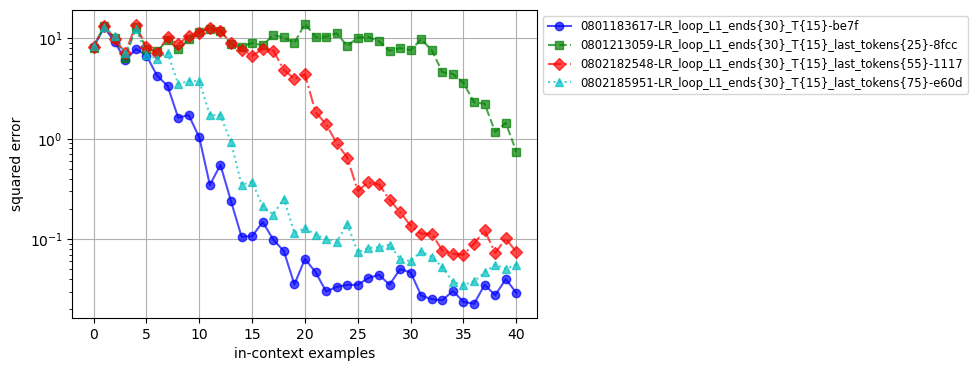
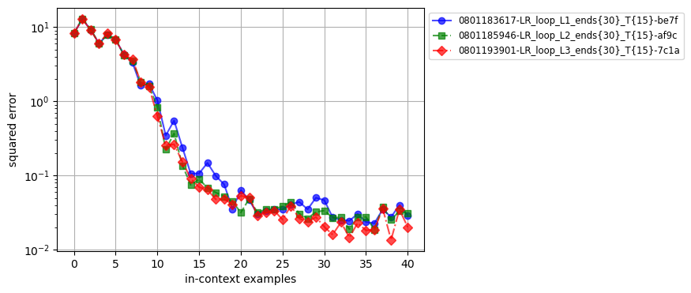
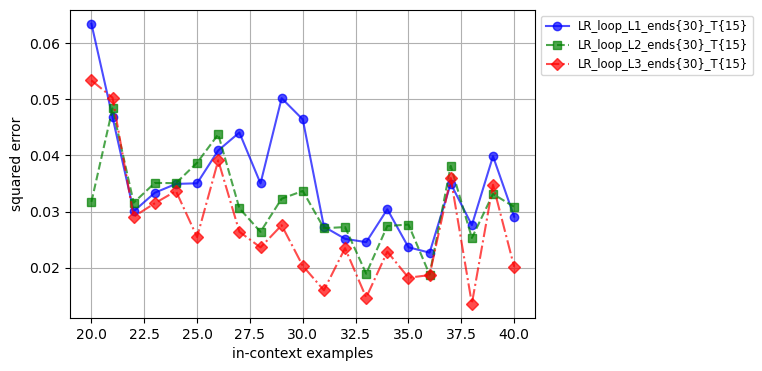
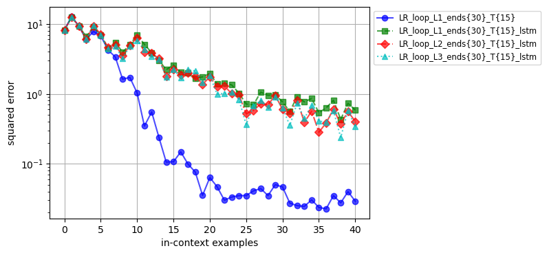
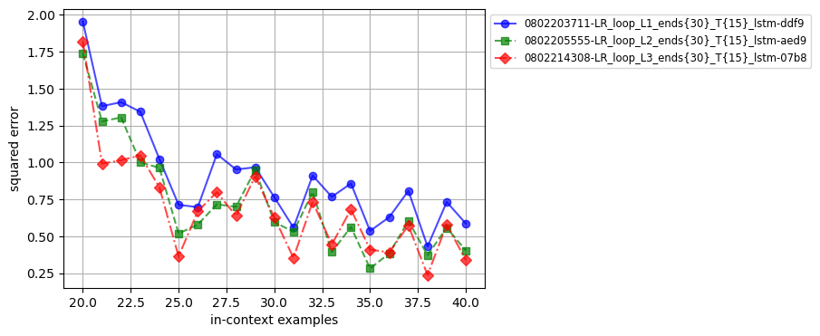

# Отчет о проведенных экспериментах с Looped Transformers

## 0. Инструкции по запуску кода

Установите и активируйте окружение через:

    conda env create -f environment.yml

    conda activate loop_tf

Для обучения стандартного трансформера используйте и выполните bash-скрипт `exec/script_baseline.sh`.

Для обучения looped трансформера используйте и выполните bash-скрипт `exec/script_loop.sh`.
    
    Параметр `b` определяет максимальное количество итераций цикла во время обучения.
    
    Параметр `T` задает размер окна цикла.

Также можете отдельно вызывать модели с помощью команд в консоли:

`python scripts/train.py --config configs/base_loop.yaml` - для decoder-only transformer.

`python scripts/train.py --config configs/base_loop.yaml` - для looped transformer.

Для построения графиков и сравнения моделей используйте notebook Charts_LR_Research.ipynb в папке jupyter_notebooks.

## 1. Введение

В ходе выполнения исследования была проанализирована статья [Looped Transformers are better at learning algorithms](https://arxiv.org/abs/2311.12424v3), в которой рассматривался подход к решению задачи in-context learning с использованием линейной регрессии и других классов функций. В статье исследовались возможности decoder-only transformer и looped transformer для улучшения обучения алгоритмам в контексте итеративных задач.

**Постановка проблемы:**
* Дается набор входных данных $\(x_1, y_1, x_2, y_2, \dots, x_k, y_k, x_{test})\$, где $\(x_i \in \mathbb{R}^n\)$ представляют собой входные данные для задачи линейной регрессии размерности $\(n\)$, а $\(y_i \in \mathbb{R}\)$ являются скалярными ответами линейной регрессии.
* Задача модели состоит в предсказании вектора весов коэффициентов линейной регрессии $\(w_i \in \mathbb{R}^n\)$. Так как $\(Xw = y\)$, это также эквивалентно предсказанию значений $\(y_i\)$.
* Минимизируется среднеквадратическая ошибка (MSE) для заданного контекста, что эквивалентно минимизации ошибки предсказания $\(y_{test}\)$, который неизвестен.

**Основная идея исследования:**
Один из методов решения задачи линейной регрессии заключается в итеративном применении градиентного спуска, что позволяет постепенно уменьшать ошибку. Для адаптации к такому подходу была использована архитектура looped transformer. В этой архитектуре входные данные многократно проходят через модель, что способствует постепенному уменьшению ошибки вычислений.


## 2. Методика исследования

В рамках исследования была проведена серия экспериментов, направленных на изучение различных аспектов архитектур моделей и эффективности обучения:

1. **Введение дополнительного входа (input injection):** В статье описан метод input injection, при котором в каждой итерации looped transformer к состоянию модели после предыдущей итерации добавляется дополнительный входной вектор. В исследовании было проанализировано, как варьирование объема информации, предоставляемой через дополнительный вход, влияет на процесс сходимости модели.

2. **Влияние количества блоков decoder-only transformer:** Исследовалась зависимость между числом блоков decoder-only transformer, входящих в один цикл looped transformer, и скоростью сходимости обучения. В эксперименте оценивалось, как изменение числа блоков влияет на эффективность и скорость обучения модели.

3. **Замена looped transformer на looped LSTM:** В рамках работы также рассматривался вопрос, как изменится эффективность модели, если заменить decoder-only transformer блоки в looped transformer на слои LSTM (Long Short-Term Memory).

Эти эксперименты позволили глубже понять, как различные настройки архитектуры и процесса обучения влияют на результаты и эффективность looped transformer.

Для обучения была использована реализация из оригинальной статьи https://github.com/leiay/looped_transformer, но с уменьшением числа шагов обучения и размерности регрессии.

### Конфиг модели для обучения:
```yaml
model:
    family: gpt2_loop
    n_embd: 256
    n_layer: 1
    n_head: 8
    n_dims: 20
    n_positions: 101
    n_last_tokens: -1
    use_lstm_layer: False

 training:
    batch_size: 64
    task_name: linear_regression
    learning_rate: 0.0001
    weight_decay: 0.0
    train_steps: 20001
    save_every_steps: 1000
    keep_every_steps: 20000
    curriculum:
        dims:
            start: 10
            end: 10
            inc: 1
            interval: 20000
        points:
            start: 11
            end: 41
            inc: 2
            interval: 1000
        loops:
            start: 20
            end: 30
            inc: 2
            interval: 500
    n_loop_window: 20
```

* Обучение включает в себя 20001 шагов.
* Размерность входных данных для регрессии ($n$, где $x \in \mathbb{R}^n$) фиксирована в процессе обучения: $n = 10$.
* Количество in-context примеров для обучения растет в процессе обучения. Изначально модель получает на вход 11 примеров. Каждые 1000 итераций количество примеров растет на 2. Максимальное количество примеров, которые модель будет видеть в процессе обучения, составляет 41.
* Количество итераций looped tansformer изначально равно 20. Каждые 500 итераций, вместе с увеличением количества семплов контекста, количество итераций также увеличивается на 2. Таким образом, в конце обучения количество итераций достигает 30.
* В процессе обучения на каждом шаге градиент вычисляется только для 20 шагов, для того чтобы ускорить обучение и стабилизировать градиент.

## 3. Проверка гипотез
### 3.1 Information Flow
**Описание эксперимента:**
Если наивно делать Universal Transformer, то ничего не получится – нужно еще подавать числа из инпута.
В описании гипотезы говорится следующее: `То есть, они конкатенируют инпут так, чтобы модель не забывала значение исходных чисел. В таком случае, модель имеет возможность использовать часть токенов как хранилище информации с предыдущего шага. Можно ли использовать меньше токенов для этого? то есть, подавать с предыдущего шага не все токены, а только n последних?`

**Процесс проведения:**
Для проверки этой гипотезы были проведены эксперименты по маскировке части выходного состояния looped transformer для каждой итерации, оставляя только n последних токенов. Для этого был доработан исходный код первоначального исследования, и в конфиг был добавлен параметр model.n_last_tokens, который отвечает за то, сколько последних токенов будет использоваться. Затем были обучены модели с параметром model.n_last_tokens равным: 20, 55 и 75.

**Cравнение результатов моделей:**


### Вывод:

Эксперимент показывает, что использование только части последних токенов из предыдущего шага негативно влияет на результаты моделей looped transformer. В частности:
- **Использование меньшего количества токенов** приводит к ухудшению результатов. Это связано с тем, что модель теряет часть информации, которая могла бы быть полезной для текущего шага.
- **Чем больше токенов маскируется**, тем сильнее наблюдается ухудшение результатов. Это подтверждает гипотезу о том, что полное сохранение информации о предыдущих токенах критично для успешной работы looped transformer.

 В результате видно, что для поддержания эффективности модели рекомендуется сохранять все токены из предыдущих шагов, чтобы не терять важные данные и контекст.

### 3.2 Looped n-layers
**Описание эксперимента:**
В описании гипотезы говорится следующее: `Что будет если зациклить не один а несколько слоев? Условно говоря, если обычный Transformer – это слои A B C D ... , Universal Transformer – это A A A A ... , то предлагается делать A B A B ... (размер зацикленного блока – произволен). Можно ли тогда делать меньше итераций на обучении?`

**Процесс проведения:**
Для проверки данной гипотезы было проведено обучение моделей looped transformer с 1, 2 и 3 слоями, для этого в конфиге модели устанавливалось значения параметра model.n_layer равным: 1, 2 и 3.

**Cравнение результатов моделей:**


**Cравнение результатов моделей:**


### Вывод:

Эксперимент показывает, что увеличение числа зацикленных слоев в модели looped transformer приводит к улучшению ее результатов. Более конкретно:

- **Добавление дополнительных слоев** (1, 2 и 3) в структуру looped transformer обеспечивает **лучшие результаты** по сравнению с использованием меньшего числа слоев. Это указывает на то, что использование большего количества слоев может улучшить способность модели к обработке и интеграции информации.
- Модели с **большим числом слоев** демонстрируют лучшее качество, что может свидетельствовать о том, что увеличение числа слоев помогает модели более эффективно извлекать и использовать информацию из входных данных.

В результате можно заметить, что добавление дополнительных слоев в looped transformer может быть полезным для повышения точности модели, однако стоит учитывать потенциальное увеличение времени обучения и вычислительных ресурсов.

### 3.3 looped LSTM testing
**Описание эксперимента:**
Как изменится эффективность модели, если заменить decoder-only transformer блоки в looped transformer на слои LSTM (Long Short-Term Memory)?

**Процесс проведения:**
Для проверки данной гипотезы был доработан исходный код первоначального исследования, и в конфиг был добавлен параметр model.use_lstm_layer, который отвечает за то, будут ли использоваться слои LSTM (значение `True`) или decoder-only transformer блоки (значение `False`). Проведено обучение моделей looped LSTM с 1, 2 и 3 слоями, для этого в конфиге модели устанавливались значение параметра model.use_lstm_layer равным `True` и значения параметра model.n_layer равным: 1, 2 и 3.

**Cравнение результатов моделей:**


**Cравнение результатов моделей:**


### 3.3 Looped LSTM Testing

**Вывод:**

Эксперимент, в котором блоки decoder-only transformer в модели looped transformer были заменены на слои LSTM (Long Short-Term Memory), показал следующие результаты:

- **Сравнение с transformer блоками**: Модели, использующие слои LSTM с параметрами `input_size=256` и `hidden_size=256` (задаются параметром model.n_embd в конфиге), демонстрируют худшие результаты по сравнению с моделями, использующими блоки decoder-only transformer c размерностью векторов эмбедингов равных 256 (задаются параметром model.n_embd в конфиге). Это указывает на то, что LSTM слои менее эффективны в данной архитектуре, чем transformer блоки.

- **Аналогичная тенденция по числу слоев**: Несмотря на то, что результаты моделей с различным числом слоев (1, 2 и 3) показывают улучшение качества, если использовать LSTM слои, прирост точности менее выражен по сравнению с использованием transformer блоков. Это подтверждает, что увеличение числа слоев в LSTM не компенсирует их относительную неэффективность.

## 4. Ключевые результаты и выводы:
**Эффективность сохранения информации:**
Использование полного набора токенов из предыдущих шагов критически важно для сохранения информации и успешной работы looped transformer. Уменьшение числа токенов, сохраняемых из предыдущих шагов, приводит к ухудшению качества предсказаний модели. Это подтверждает необходимость сохранения полной информации для достижения высоких результатов.

**Влияние числа слоев в looped transformer:**
Увеличение числа слоев в looped transformer (1, 2 и 3 слоя) ведет к улучшению качества модели. Модели с большим количеством слоев демонстрируют лучшие результаты, что свидетельствует о способности модели более эффективно обрабатывать и интегрировать информацию из входных данных. Это также указывает на то, что добавление слоев может помочь в достижении более высокой точности и более глубокого понимания данных, однако стоит учитывать потенциальное увеличение времени обучения и вычислительных ресурсов..

**Сравнение с LSTM слоями:**
Замена блоков decoder-only transformer на LSTM слои в looped transformer приводит к значительному ухудшению результатов. Несмотря на увеличение числа слоев в LSTM, эффективность модели остаётся ниже по сравнению с использованием transformer блоков. Это указывает на то, что LSTM менее подходящи для задач, требующих сложной обработки и интеграции информации, чем transformer блоки.
