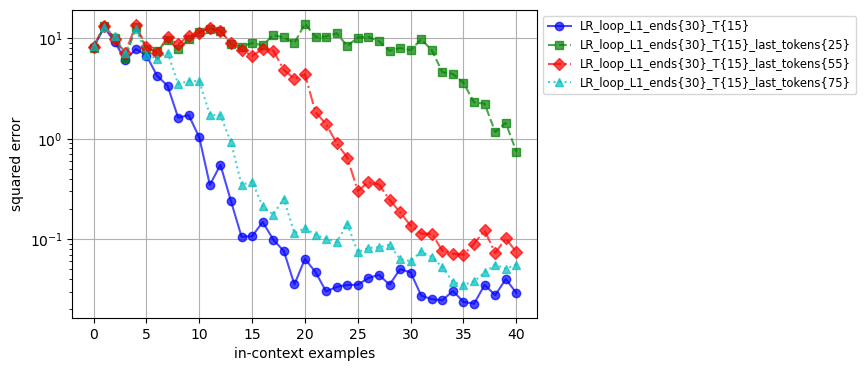

# Отчет по исследованию Looped Transformers

## 1. Введение

В ходе выполнения исследования была проанализирована статья [Looped Transformers are better at learning algorithms](https://arxiv.org/abs/2311.12424v3), в которой рассматривался подход к решению задачи in-context learning с использованием линейной регрессии и других классов функций. В статье исследовались возможности decoder-only transformer и looped transformer для улучшения обучения алгоритмам в контексте итеративных задач.

**Постановка проблемы:**
* Дается набор входных данных $\(x_1, y_1, x_2, y_2, \dots, x_k, y_k, x_{test})\$, где $\(x_i \in \mathbb{R}^n\)$ представляют собой входные данные для задачи линейной регрессии размерности $\(n\)$, а $\(y_i \in \mathbb{R}\)$ являются скалярными ответами линейной регрессии.
* Задача модели состоит в предсказании вектора весов коэффициентов линейной регрессии $\(w_i \in \mathbb{R}^n\)$. Так как $\(Xw = y\)$, это также эквивалентно предсказанию значений $\(y_i\)$.
* Минимизируется среднеквадратическая ошибка (MSE) для заданного контекста, что эквивалентно минимизации ошибки предсказания $\(y_{test}\)$, который неизвестен.

**Основная идея исследования:**
Один из методов решения задачи линейной регрессии заключается в итеративном применении градиентного спуска, что позволяет постепенно уменьшать ошибку. Для адаптации к такому подходу была использована архитектура looped transformer. В этой архитектуре входные данные многократно проходят через модель, что способствует постепенному уменьшению ошибки вычислений.


## 2. Методика исследования

В рамках исследования была проведена серия экспериментов, направленных на изучение различных аспектов архитектур моделей и эффективности обучения:

1. **Введение дополнительного входа (input injection):** В статье описан метод input injection, при котором в каждой итерации looped transformer к состоянию модели после предыдущей итерации добавляется дополнительный входной вектор. В исследовании было проанализировано, как варьирование объема информации, предоставляемой через дополнительный вход, влияет на процесс сходимости модели.

2. **Влияние количества блоков decoder-only transformer:** Исследовалась зависимость между числом блоков decoder-only transformer, входящих в один цикл looped transformer, и скоростью сходимости обучения. В эксперименте оценивалось, как изменение числа блоков влияет на эффективность и скорость обучения модели.

3. **Замена трансформерных блоков на LSTM:** В рамках работы также рассматривался вопрос, как замена decoder-only transformer блоков на слои LSTM (Long Short-Term Memory) изменяет эффективность модели.

Эти эксперименты позволили глубже понять, как различные настройки архитектуры и процесса обучения влияют на результаты и эффективность looped transformer.

Для обучения была использована реализация из оригинальной статьи https://github.com/leiay/looped_transformer, но с уменьшением числа шагов обучения и размерности регрессии.
```yaml
model:
    family: gpt2_loop
    n_embd: 256
    n_layer: 1
    n_head: 8
    n_dims: 20
    n_positions: 101
    n_last_tokens: -1
    use_lstm_layer: True

 training:
    batch_size: 64
    task_name: linear_regression
    learning_rate: 0.0001
    weight_decay: 0.0
    train_steps: 20001
    save_every_steps: 1000
    keep_every_steps: 20000
    curriculum:
        dims:
            start: 10
            end: 10
            inc: 1
            interval: 20000
        points:
            start: 11
            end: 41
            inc: 2
            interval: 1000
        loops:
            start: 20
            end: 30
            inc: 2
            interval: 500
    n_loop_window: 20
```

* Обучение включает в себя 20001 шагов.
* Размерность входных данных для регрессии ($n$, где $x \in \mathbb{R}^n$) фиксирована в процессе обучения: $n = 10$.
* Количество in-context примеров для обучения растет в процессе обучения. Изначально модель получает на вход 11 примеров. Каждые 1000 итераций количество примеров растет на 2. Максимальное количество примеров, которые модель будет видеть в процессе обучения, составляет 41.
* Количество итераций looped tansformer изначально равно 20. Каждые 500 итераций, вместе с увеличением количества семплов контекста, количество итераций также увеличивается на 2. Таким образом, в конце обучения количество итераций достигает 30.
* В процессе обучения на каждом шаге градиент вычисляется только для 20 шагов, для того чтобы ускорить обучение и стабилизировать градиент.

## 3. Проверка гипотез
### 3.1 Information Flow
Если наивно делать Universal Transformer, то ничего не получится – нужно еще подавать числа из инпута.
В описании гипотезы говорится следующее: `То есть, они конкатенируют инпут так, чтобы модель не забывала значение исходных чисел. В таком случае, модель имеет возможность использовать часть токенов как хранилище информации с предыдущего шага. Можно ли использовать меньше токенов для этого? то есть, подавать с предыдущего шага не все токены, а только n последних?`

**Процесс проведения:**
Для проверки этой гипотезы я провел эксперименты по маскировке части выходного состояния looped transformer для каждой итерации, оставляя только n последних токенов. Для этого был доработан исходный код первоначального исследования, и введен параметр n_last_tokens, который отвечает за то, сколько последних токенов будет использоваться. Затем были обучены модели с параметром n_last_tokens равным: 20, 55, 75.

**Cравнение результатов моделей:**


### Вывод:

Результаты экспериментов показывают, что использование только части последних токенов из предыдущего шага негативно влияет на результаты моделей looped transformer. В частности:
- **Использование меньшего количества токенов** приводит к ухудшению результатов. Это связано с тем, что модель теряет часть информации, которая могла бы быть полезной для текущего шага.
- **Чем больше токенов маскируется**, тем сильнее наблюдается ухудшение результатов. Это подтверждает гипотезу о том, что полное сохранение информации о предыдущих токенах критично для успешной работы looped transformer.

Таким образом, для поддержания эффективности модели рекомендуется сохранять все токены из предыдущих шагов, чтобы не терять важные данные и контекст.
