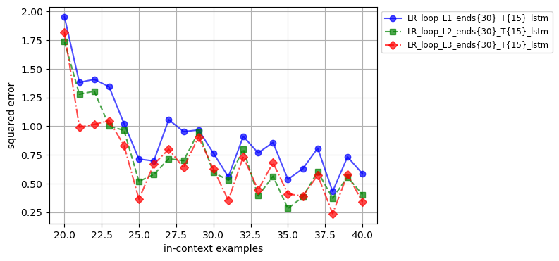

 # Отчет о проведенных экспериментах с Looped Transformers

## Содержание
- [Инструкция по установке и запуску](#0-инструкция-по-установке-и-запуску)
- [Введение](#1-введение)
- [Методика исследования](#2-методика-исследования)
- [Проверка гипотез](#3-проверка-гипотез)
    - [Information Flow](#31-information-flow)
    - [Looped n-layers](#32-looped-n-layers)
    - [Looped LSTM testing](#33-looped-lstm-testing)
- [Ключевые результаты и выводы](#4-ключевые-результаты-и-выводы)
- [Мои статьи по машинному обучению](#5-мои-статьи-по-машинному-обучению)

## 0. Инструкция по установке и запуску

Установите и активируйте окружение через:

    conda env create -f environment.yml

    conda activate loop_tf
    
Если у вас еще нет API-ключа, вам нужно его получить. Зайдите на сайт [WandB](https://wandb.ai/) и войдите в свою учетную запись. Вы сможете создать новый API-ключ, если у вас его нет, или скопировать уже существующий.

Откройте конфигурационный файл `wandb.yaml`, который находится в папке `configs`.

### Конфигурационный файл wandb:
```yaml
wandb:
    project: loop_tf
    notes:
    log_every_steps: 100
    key: your_api_key
```
Замените `your_api_key` на ваш API-ключ.

Можно отдельно вызывать модели с помощью команд в консоле из настроенного conda окружения:

`python scripts/train.py --config configs/base.yaml` - для decoder-only transformer

`python scripts/train.py --config configs/base_loop.yaml` - для looped transformer

Также можно передавать параметры, указывая их в качестве аргументов в консоле. В качестве примера запустим на обучение модель looped transformer с некоторым наборов аргументов:

`python scripts/train.py
    --config configs/base_loop.yaml
    --model.n_layer 1
    --training.curriculum.loops.start 15
    --training.curriculum.loops.end 30
    --training.n_loop_window 15
    --wandb.name "LR_loop_L1_ends{30}_T{15}"
    --gpu.n_gpu 0`

Описание каждого параметра, передаваемого через консоль в примере выше:

1. `python scripts/train.py`:
   - Запускает скрипт `train.py`, расположенный в папке `scripts`.

2. `--config configs/base_loop.yaml`:
   - Указывает конфигурационный файл `base_loop.yaml`, расположенный в папке `configs`. Этот файл содержит основные настройки для тренировки модели.

3. `--model.n_layer 1`:
   - Задает количество слоев в модели. В данном случае, модель будет иметь один слой.

4. `--training.curriculum.loops.start 15`:
   - Устанавливает начальное количество итераций для Looped Transformer'a в процессе обучения. Здесь начальное значение равно 15.

5. `--training.curriculum.loops.end 30`:
   - Устанавливает конечное количество итераций для Looped Transformer'a, до которого модель будет увеличивать это значение в процессе обучения. Здесь конечное значение равно 30.

6. `--training.n_loop_window 15`:
   - Определяет количество шагов, на которых будет вычисляться градиент. В данном случае, значение равно 15, что помогает ускорить обучение и стабилизировать градиент.

7. `--wandb.name "LR_loop_L1_ends{30}_T{15}"`:
   - Задает имя для эксперимента в Weights & Biases (wandb), что полезно для отслеживания и управления экспериментами. В данном случае, имя эксперимента включает информацию о количестве слоев, конечном количестве итераций и других параметрах, что помогает идентифицировать эксперимент.

8. `--gpu.n_gpu 0`:
   - Указывает использовать GPU с индексом 0 для обучения. Это позволяет задать, на каком GPU будет выполняться тренировка, если в системе доступно несколько GPU.

В пункте [3. Проверка гипотез](#3-проверка-гипотез) будет подробная инструкция как обучить модели для проверки гипотез.

Для построения графиков и сравнения моделей используйте notebook `Charts_LR_Research.ipynb` в папке `jupyter_notebooks`.

## 1. Введение

В ходе выполнения исследования была проанализирована статья [Looped Transformers are better at learning algorithms](https://arxiv.org/abs/2311.12424v3), в которой рассматривался подход к решению задачи in-context learning с использованием линейной регрессии и других классов функций. В статье исследовались возможности decoder-only transformer и looped transformer для улучшения обучения алгоритмов в контексте итеративных задач.

**Постановка проблемы:**
* Дается набор входных данных $\(x_1, y_1, x_2, y_2, \dots, x_k, y_k, x_{test})\$, где $\(x_i \in \mathbb{R}^n\)$ представляют собой входные данные для задачи линейной регрессии размерности $\(n\)$, а $\(y_i \in \mathbb{R}\)$ являются скалярными ответами линейной регрессии.
* Задача модели заключается в предсказании вектора весов коэффициентов линейной регрессии $\(w_i \in \mathbb{R}^n\)$. Так как $\(Xw = y\)$, это также эквивалентно предсказанию значений $\(y_i\)$.
* Минимизируется среднеквадратическая ошибка (MSE) для заданного контекста $\(\min_w \|Xw - y\|^2_2)\$, тем самым минимизируем ошибки предсказания $\(y_{test}\)$, которые неизвестены.

**Основная идея исследования:**
Один из методов решения задачи линейной регрессии заключается в итеративном применении градиентного спуска, что позволяет постепенно уменьшать ошибку. Для адаптации к такому подходу была использована архитектура looped transformer. В этой архитектуре входные данные многократно проходят через модель, что способствует постепенному уменьшению ошибки вычислений.


## 2. Методика исследования

В рамках исследования была проведена серия экспериментов, направленных на изучение различных аспектов архитектур моделей и эффективности обучения:

1. **Введение дополнительного входа (input injection):** В статье описан метод input injection, при котором в каждой итерации looped transformer к состоянию модели после предыдущей итерации добавляется дополнительный входной вектор. В исследовании было проанализировано, как варьирование объема информации, предоставляемой через дополнительный вход, влияет на процесс сходимости модели.

2. **Влияние количества блоков decoder-only transformer:** Исследовалась зависимость между числом блоков decoder-only transformer, входящих в один цикл looped transformer, и скоростью сходимости обучения. В эксперименте оценивалось, как изменение числа блоков влияет на эффективность и скорость обучения модели.

3. **Замена looped transformer на looped LSTM:** В рамках работы также рассматривался вопрос, как изменится эффективность модели, если заменить decoder-only transformer блоки в looped transformer на слои LSTM (Long Short-Term Memory).

Эти эксперименты позволили глубже понять, как различные настройки архитектуры и процесса обучения влияют на результаты и эффективность looped transformer.
 
Для обучения модели была использована реализация из оригинальной статьи, доступная по [ссылке](https://github.com/leiay/looped_transformer). Однако, в процессе работы были внесены некоторые изменения:

1. Уменьшено число шагов обучения.
2. Уменьшена размерность регрессии.
3. Добавлены два новых параметра: `model.n_last_tokens` и `model.use_lstm_layer`, которые можно настроить в конфигурационном файле модели.

### Описание новых параметров:

- **model.n_last_tokens**:
  - Определяет, сколько последних токенов, подаваемых на вход каждого слоя, будет использоваться.
  - Если значение параметра равно `0`, модель не будет использовать токены с входа.
  - Если задано положительное целочисленное значение, модель возьмет указанное количество токенов с конца, замаскировав предыдущие токены.
  - Если задано отрицательное целочисленное значение (например, `-1`), все токены с входа будут использоваться.

- **model.use_lstm_layer**:
  - Определяет, будут ли использоваться слои LSTM.
  - Если значение параметра равно `True`, будут использоваться LSTM-слои.
  - Если значение параметра равно `False`, будут использоваться блоки decoder-only transformer.

### Пример конфигурационного файла модели:
```yaml
model:
    family: gpt2_loop
    n_embd: 256
    n_layer: 1
    n_head: 8
    n_dims: 20
    n_positions: 101
    n_last_tokens: -1
    use_lstm_layer: False

training:
    batch_size: 64
    task_name: linear_regression
    learning_rate: 0.0001
    weight_decay: 0.0
    train_steps: 20001
    save_every_steps: 1000
    keep_every_steps: 20000
    curriculum:
        dims:
            start: 10
            end: 10
            inc: 1
            interval: 20000
        points:
            start: 11
            end: 41
            inc: 2
            interval: 1000
        loops:
            start: 15
            end: 30
            inc: 2
            interval: 500
    n_loop_window: 15
```

* Обучение включает в себя 20001 шагов.
* Размерность входных данных для регрессии ($n$, где $x \in \mathbb{R}^n$) фиксирована в процессе обучения: $n = 10$.
* Количество in-context примеров для обучения растет в процессе обучения. Изначально модель получает на вход 11 примеров. Каждые 1000 итераций количество примеров растет на 2. Максимальное количество примеров, которые модель будет видеть в процессе обучения, составляет 41.
* Количество итераций looped tansformer изначально равно 20. Каждые 500 итераций, вместе с увеличением количества семплов контекста, количество итераций также увеличивается на 2. Таким образом, в конце обучения количество итераций достигает 30.
* В процессе обучения на каждом шаге градиент вычисляется только для 20 шагов, для того чтобы ускорить обучение и стабилизировать градиент.

## 3. Проверка гипотез
### 3.1 Information Flow
**Описание эксперимента:**
Если наивно делать Universal Transformer, то ничего не получится – нужно еще подавать числа из инпута.
В описании гипотезы говорится следующее: `То есть, они конкатенируют инпут так, чтобы модель не забывала значение исходных чисел. В таком случае, модель имеет возможность использовать часть токенов как хранилище информации с предыдущего шага. Можно ли использовать меньше токенов для этого? То есть, подавать с предыдущего шага не все токены, а только n последних?`

**Процесс проведения:**
Для проверки этой гипотезы были проведены эксперименты по маскировке части выходного состояния looped transformer для каждой итерации, оставляя только n последних токенов. Для этого был доработан исходный код первоначального исследования, и в конфигурационный файл модели был добавлен параметр model.n_last_tokens, который отвечает за то, сколько последних токенов, подаваемых на вход каждого слоя, будет использоваться. Затем были обучены модели с параметром model.n_last_tokens равным: 25, 55, 75 и -1 (для того, чтобы использовать все входные токены).

#### 3.1.1 Запустим на обучение модель looped transformer с параметром model.n_last_tokens = 20
Для этого введем в консоль команду:
`python scripts/train.py
    --config configs/base_loop_L1_ends{30}_T{15}_n_last_tokens{20}.yaml`

#### 3.1.2 Запустим на обучение модель looped transformer с параметром model.n_last_tokens = 55
Для этого введем в консоль команду:
`python scripts/train.py
    --config configs/base_loop_L1_ends{30}_T{15}_n_last_tokens{55}.yaml`

#### 3.1.3 Запустим на обучение модель looped transformer с параметром model.n_last_tokens = 75
Для этого введем в консоль команду:
`python scripts/train.py
    --config configs/base_loop_L1_ends{30}_T{15}_n_last_tokens{75}.yaml`

#### 3.1.4 Запустим на обучение модель looped transformer с параметром model.n_last_tokens = -1
Для этого введем в консоль команду:
`python scripts/train.py
    --config configs/base_loop_L1_ends{30}_T{15}.yaml`

**Cравнение результатов моделей:**


**Вывод:**

Эксперимент показывает, что использование только части последних токенов из предыдущего шага негативно влияет на результаты моделей looped transformer. В частности:
- **Использование меньшего количества токенов** приводит к ухудшению результатов. Это связано с тем, что модель теряет часть информации, которая могла бы быть полезной для текущего шага.
- **Чем больше токенов маскируется**, тем сильнее наблюдается ухудшение результатов. Это подтверждает гипотезу о том, что полное сохранение информации о предыдущих токенах критично для успешной работы looped transformer.

 В результате видно, что для поддержания эффективности модели рекомендуется сохранять все токены из предыдущих шагов, чтобы не терять важные данные и контекст.

### 3.2 Looped n-layers
**Описание эксперимента:**
В описании гипотезы говорится следующее: `Что будет, если зациклить не один, а несколько слоев? Условно говоря, если обычный Transformer – это слои A B C D ... , Universal Transformer – это A A A A ... , то предлагается делать A B A B ... (размер зацикленного блока – произволен). Можно ли тогда делать меньше итераций на обучении?`

**Процесс проведения:**
Для проверки данной гипотезы было проведено обучение моделей looped transformer с 1, 2 и 3 слоями, для этого в конфигурационном файле модели устанавливалось значение параметра model.n_layer равным: 1, 2 и 3.

#### 3.2.1 Запустим на обучение модель looped transformer с параметром model.n_layer = 1
Для этого введем в консоль команду:
`python scripts/train.py
    --config configs/base_loop_L1_ends{30}_T{15}.yaml`

#### 3.2.2 Запустим на обучение модель looped transformer с параметром model.n_layer = 2
Для этого введем в консоль команду:
`python scripts/train.py
    --config configs/base_loop_L2_ends{30}_T{15}.yaml`

#### 3.2.3 Запустим на обучение модель looped transformer с параметром model.n_layer = 3
Для этого введем в консоль команду:
`python scripts/train.py
    --config configs/base_loop_L3_ends{30}_T{15}.yaml`

**Cравнение результатов моделей:**


**Cравнение результатов моделей:**


**Вывод:**

Эксперимент показывает, что увеличение числа зацикленных слоев в модели looped transformer приводит к улучшению ее результатов. Более конкретно:

- **Добавление дополнительных слоев** (1, 2 и 3) в структуру looped transformer обеспечивает **лучшие результаты** по сравнению с использованием меньшего числа слоев. Это указывает на то, что использование большего количества слоев может улучшить способность модели к обработке и интеграции информации.
- Модели с **большим числом слоев** демонстрируют лучшее качество, что может свидетельствовать о том, что увеличение числа слоев помогает модели более эффективно извлекать и использовать информацию из входных данных.

В результате можно заметить, что добавление дополнительных слоев в looped transformer может быть полезным для повышения точности модели, однако стоит учитывать потенциальное увеличение времени обучения и вычислительных ресурсов.

### 3.3 Looped LSTM testing
**Описание эксперимента:**
Как изменится эффективность модели, если заменить decoder-only transformer блоки в looped transformer на слои LSTM (Long Short-Term Memory)?

**Процесс проведения:**
Для проверки данной гипотезы был доработан исходный код первоначального исследования, и в конфигурационный файл модели был добавлен параметр model.use_lstm_layer, который отвечает за то, будут ли использоваться слои LSTM (значение `True`) или decoder-only transformer блоки (значение `False`). Проведено обучение моделей looped LSTM с 1, 2 и 3 слоями, для этого в конфигурационном файле модели устанавливались значение параметра model.use_lstm_layer равным `True` и значение параметра model.n_layer равным: 1, 2 и 3.

#### 3.2.1 Запустим на обучение модель looped LSTM с параметром model.n_layer = 1
Для этого введем в консоль команду:
`python scripts/train.py
    --config configs/base_loop_L1_ends{30}_T{15}_lstm.yaml`

#### 3.2.2 Запустим на обучение модель looped LSTM с параметром model.n_layer = 2
Для этого введем в консоль команду:
`python scripts/train.py
    --config configs/base_loop_L2_ends{30}_T{15}_lstm.yaml`

#### 3.2.3 Запустим на обучение модель looped LSTM с параметром model.n_layer = 3
Для этого введем в консоль команду:
`python scripts/train.py
    --config configs/base_loop_L3_ends{30}_T{15}_lstm.yaml`

**Cравнение результатов моделей:**


**Cравнение результатов моделей:**


**Вывод:**

Эксперимент, в котором блоки decoder-only transformer в модели looped transformer были заменены на слои LSTM (Long Short-Term Memory), показал следующие результаты:

- **Сравнение с transformer блоками**: Модели, использующие слои LSTM с параметрами `input_size=256` и `hidden_size=256` (задаются параметром model.n_embd в конфигурационном файле модели), демонстрируют худшие результаты по сравнению с моделями, использующими блоки decoder-only transformer c размерностью векторов эмбедингов равных 256 (задаются параметром model.n_embd в конфигурационном файле модели). Это указывает на то, что LSTM слои менее эффективны в данной архитектуре, чем transformer блоки.

- **Аналогичная тенденция по числу слоев**: Несмотря на то, что результаты моделей с различным числом слоев (1, 2 и 3) показывают улучшение качества, если использовать LSTM слои, прирост точности менее выражен по сравнению с использованием transformer блоков. Это подтверждает, что увеличение числа слоев в LSTM не компенсирует их относительную неэффективность.

## 4. Ключевые результаты и выводы
**Эффективность сохранения информации:**
Использование полного набора токенов из предыдущих шагов критически важно для сохранения информации и успешной работы looped transformer. Уменьшение числа токенов, сохраняемых из предыдущих шагов, приводит к ухудшению качества предсказаний модели. Это подтверждает необходимость сохранения полной информации для достижения высоких результатов.

**Влияние числа слоев в looped transformer:**
Увеличение числа слоев в looped transformer (1, 2 и 3 слоя) ведет к улучшению качества модели. Модели с большим количеством слоев демонстрируют лучшие результаты, что свидетельствует о способности модели более эффективно обрабатывать и интегрировать информацию из входных данных. Это также указывает на то, что добавление слоев может помочь в достижении более высокой точности и более глубокого понимания данных, однако стоит учитывать потенциальное увеличение времени обучения и вычислительных ресурсов..

**Сравнение с LSTM слоями:**
Замена блоков decoder-only transformer на LSTM слои в looped transformer приводит к значительному ухудшению результатов. Несмотря на увеличение числа слоев в LSTM, эффективность модели остаётся ниже по сравнению с использованием transformer блоков. Это указывает на то, что LSTM слои хуже справляется с задачами, требующими сложной обработки и интеграции информации, чем decoder-only transformer блоки.

## 5. Мои статьи по машинному обучению
Также хотелось бы поделиться своими исследованиями, отраженными в следующих статьях журналов из перечня ВАК и РИНЦ.
1. Астраханцева, И., Герасимов, А., &amp; Смирнова, О. (2024). Оценка применимости статистических и машинных моделей для прогнозирования инфляции. Современные наукоёмкие технологии. Региональное приложение, 79(3), 120-131. извлечено от http://snt-isuct.ru/article/view/6049
2. Астраханцева И.А., Герасимов А.С. Прогнозирование региональной инфляции на основе гибридной модели машинного обучения: градиентный бустинг и случайный лес НАУЧНЫЕ ТРУДЫ Вольного экономического общества России – 2023. – № 5. – С. 200-226. – DOI: 10.38197/2072-2060-2023-243-5-200-226 https://cyberleninka.ru/article/n/prognozirovanie-regionalnoy-inflyatsii-na-osnove-gibridnoy-modeli-mashinnogo-obucheniya-gradientnyy-busting-i-sluchaynyy-les
3. Астраханцева И.А., Герасимов А.С., Астраханцев Р.Г. Прогнозирование региональной инфляции с помощью алгоритмов машинного обучения. Известия высших учебных заведений. Серия: Экономика, финансы и управление производством. – 2022. – № 4(54). – С. 6–13. DOI 10.6060/ivecofin.2022544.620. – EDN ITYDFE. https://cyberleninka.ru/article/n/prognozirovanie-regionalnoy-inflyatsii-s-pomoschyu-algoritmov-mashinnogo-obucheniya
4. Герасимов А.С., Бобкова С.П. Применение машинного обучения для прогнозирования результатов подготовки студентов. Сборник научных трудов вузов России «Проблемы экономики, финансов и управления производством» - 2022.- № 50 – С.56-62 УДК: 004.94 (РИНЦ 2018) https://elibrary.ru/item.asp?edn=hrumrz
